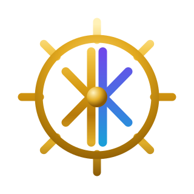
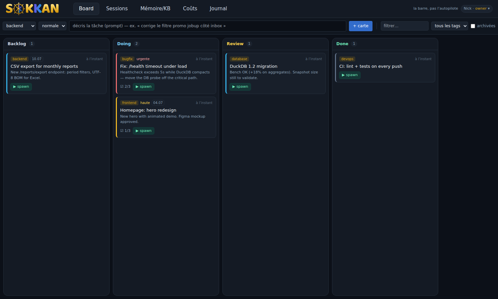

<p align="center">
  
</p>

<h1 align="center">SOKKAN</h1>
<p align="center><em>The helm, not the autopilot.</em></p>

SOKKAN is a self-hosted web cockpit for running **multiple Claude Code sessions in parallel** — with the one thing no orchestrator gives you: **your project memory, automatically injected into every session at spawn**.

Spawning a session *is* the "check your memory" ritual: the task description seeds a semantic search over your accumulated project notes (RAG over the memory files Claude Code already writes), so every session starts already knowing what previous sessions learned. Nothing goes to Done without a human at the helm.

<p align="center">
  
</p>
<p align="center">
  <em>One take (worked segment sped up 3.5×): card → ▶ spawn → the session searches the project memory first, recalls the port and the team convention — facts that only exist in the notes — grounds itself in the code, proposes a plan, and <b>waits for your go</b>.</em>
</p>

<p align="center">
  
</p>

## Features

- **Sessions** — a rail of live sessions and a multi-pane chat grid (built on the official Claude Agent SDK: tool calls, permission prompts and multiple-choice questions render as native web widgets, not scraped terminal output)
- **Board** — a kanban where cards spawn pre-seeded sessions (`▶ spawn` → the card's description becomes the task, memory context loads first, the agent proposes a plan and waits for your go)
- **Memory/KB** — inspect the RAG store: notes, links, backlinks, and a search playground showing exactly what a session would recall
- **Costs** — per-day / per-session token usage and estimated API cost, aggregated from the transcripts
- **Journal** — an audit trail of every action (who spawned, moved, deleted what — the basis for reverting)
- Sessions can talk back: bundled MCP servers let any session **search the memory**, **create/move board cards**, and **push a preview** of what it changed

## Requirements

- **Linux** x86_64/arm64 — or macOS with [Docker Desktop](https://docs.docker.com/desktop/)/OrbStack
- **Docker Engine 24+ with Compose v2** — no Docker? **the installer offers to
  install it for you** (official `get.docker.com` script). On Ubuntu, note the
  apt package is `docker.io`, not `docker` — or just let the installer handle it.
- ~4 GB free RAM (local embedding model + first build), ~3 GB disk
- An Anthropic API key, or a Claude Pro/Max subscription (`claude setup-token`)

## Quickstart

```bash
curl -fsSL https://sokkan.ch/install.sh | sh
```

— downloads the latest release from sokkan.ch (no GitHub dependency), generates an access token, and tells you what to fill in. Or the manual way:

```bash
git clone https://github.com/ninabot-ch/sokkan && cd sokkan
cp .env.example .env
# edit .env: set ANTHROPIC_API_KEY (or CLAUDE_CODE_OAUTH_TOKEN),
# SOKKAN_WORKSPACE (your project path), SOKKAN_LOCAL_TOKEN (openssl rand -hex 24)
docker compose up -d --build
```

Open `http://localhost:3009`, enter your token, hit **+ session** — the first run downloads the local embedding model (~120 MB, cached in the data volume).

Write memory notes as markdown files (one fact per file, with a `description:` frontmatter) — Claude Code sessions write them natively under the workspace's memory directory, and SOKKAN indexes them within ~2 minutes. From then on, every new session starts with that context.

### Using a Claude subscription instead of an API key

If you use Claude Code with a Pro/Max subscription rather than an API key, generate a long-lived token once on your desktop and put it in `.env`:

```bash
claude setup-token          # one-time browser login
# → paste the token into .env as CLAUDE_CODE_OAUTH_TOKEN
```

## Configuration

| Variable | Default | Purpose |
|---|---|---|
| `ANTHROPIC_API_KEY` | — | BYOK key the `claude` CLI uses |
| `SOKKAN_WORKSPACE` | `./workspace` | Host path mounted at `/workspace` (the project sessions work on) |
| `SOKKAN_LOCAL_TOKEN` | *(empty)* | Login token; empty = open access (trusted networks only) |
| `SOKKAN_OWNER_EMAIL` / `_NAME` | `owner@localhost` | Identity in UI + audit journal |
| `SOKKAN_PORT` | `3009` | Web UI port |
| `ML_SERVICE_URL` | *(empty)* | Optional remote embedding endpoint; empty = local ONNX (multilingual MiniLM) |
| `SOKKAN_AUTH_MODE` | `local` | `local` · `oidc` (Authentik/Keycloak/…) · `cf-access` |
| `SOKKAN_FEATURE_PREVIEW` / `_TMUX` | `0` in container | Extra tabs for bare-metal installs (dev-server previews, tmux terminal mode) |

OIDC single sign-on (`SOKKAN_AUTH_MODE=oidc` + `SOKKAN_OIDC_*`) and multi-user roles (viewer/dev/admin/owner) are built in — see `backend/auth.py`.

## Architecture

```
browser ── Next.js (web) ──/api──► FastAPI (api) ──► claude CLI (Agent SDK, stream-json)
                                      │                   │
                                      │                   └─ MCP: sokkan-memory · sokkan-board
                                      ├─ SQLite: board · audit · usage · iam
                                      └─ memory indexer (fastembed ONNX ⟷ optional remote)
```

Everything stays on your machine: SQLite state in a Docker volume, transcripts written by the `claude` CLI itself, LLM calls straight from your container to Anthropic with your key.

## Security model

**The boundary is the container.** Agent sessions execute tools inside the
`api` container (running as a non-root user) against `/workspace` — mount only
what they should touch. Mutating tools (Bash, Edit, Write, …) require your
click-through approval in the chat pane; reads and the bundled read-only MCP
tools are auto-allowed. Nothing irreversible happens without a click.

**Roles.** `viewer < dev < admin < owner`, stored in SOKKAN's own SQLite.
Spawning sessions, sending prompts and mutating the board require `dev`;
managing users requires `admin`; the `owner` cannot be deleted. An
authenticated email that is not in the users table gets `SOKKAN_DEFAULT_ROLE`
(default `viewer`; set it to `none` to reject unknown emails with 403).

**Auth.** `local` (single-user token, rate-limited: 5 failures/min per IP),
`oidc` (Authentik, Keycloak, …) or `cf-access`. WebSockets verify the browser
`Origin` against `SOKKAN_PUBLIC_URL` (or the request host). There is no CORS
layer to misconfigure: the browser only ever talks to the web origin, which
proxies `/api`.

**Feature flags are enforced server-side.** On the public container,
preview/tmux endpoints are disabled (`404`) — `/api/features` is a UI hint,
not the enforcement.

**Preview SSRF policy** (instances with `SOKKAN_FEATURE_PREVIEW=1`): screenshot
targets are resolved before Chromium runs; private, loopback, link-local and
cloud-metadata addresses are refused unless `SOKKAN_PREVIEW_ALLOW_PRIVATE=1`.

**Other notes.**
- Set `SOKKAN_LOCAL_TOKEN` unless the instance is unreachable from anything you don't trust.
- The audit journal records actions, not conversation content.
- No telemetry: the memory index, embeddings and data never leave your machine —
  the only outbound traffic is your prompts to Anthropic, as with any Claude Code use.
- Vulnerabilities: email security@ninabot.ch (please don't open a public issue).

## Status

Early. Born as the internal cockpit running [ninjob.ch](https://ninjob.ch) and its sibling products (≈30 commits/week across 9 parallel sessions); extracted and open-sourced because thin wrappers die and memory is the part that compounds. Roadmap: multi-provider sessions (Codex, …), project scoping, one-command cloud deploy.

## License

[Apache-2.0](LICENSE) — the code is free, self-hosted, BYOK. A managed Swiss-hosted cloud is planned; that operation is the business, not withheld features.
