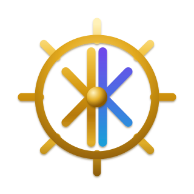
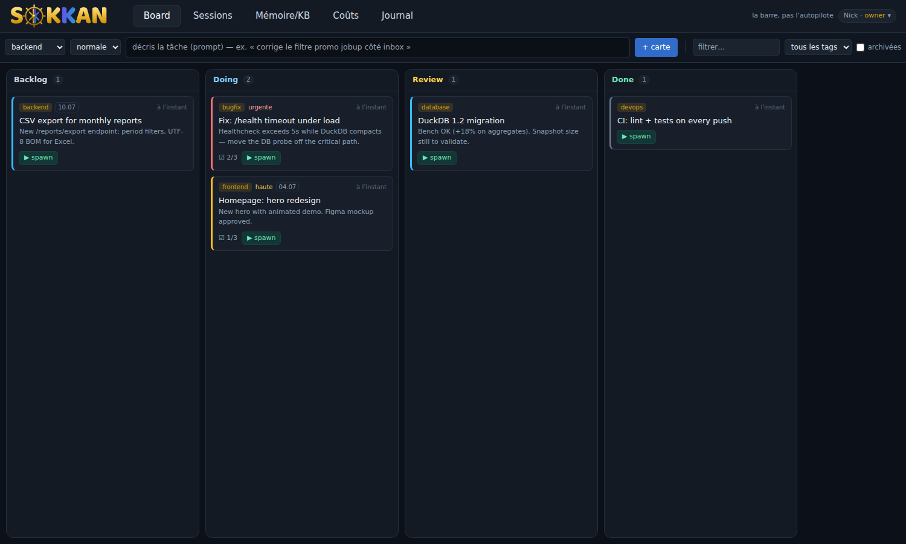

<p align="center">
  
</p>

<h1 align="center">SOKKAN</h1>
<p align="center"><em>The helm, not the autopilot.</em></p>

<p align="center">
  <a href="https://github.com/ninabot-ch/sokkan/actions/workflows/ci.yml"></a>
  <a href="https://github.com/ninabot-ch/sokkan/tags"></a>
  <a href="LICENSE"></a>
  <a href="https://sokkan.ch"></a>
</p>

SOKKAN is a self-hosted web cockpit for running **multiple Claude Code sessions in parallel** — with the one thing no orchestrator gives you: **your project memory, automatically injected into every session at spawn**.

Spawning a session *is* the "check your memory" ritual: the task description seeds a semantic search over your accumulated project notes (RAG over the memory files Claude Code already writes), so every session starts already knowing what previous sessions learned. Nothing goes to Done without a human at the helm.

**European by design.** Self-host it on your own hardware — your data never leaves your machine — or run it managed and **sovereign on Swiss infrastructure** ([SOKKAN Cloud](https://sokkan.ch/en/#cloud)): a dedicated VM and private network per customer, EU/CH inference options, and your content never used for training. Details on the [trust page](https://sokkan.ch/en/trust/).

<p align="center">
  
</p>
<p align="center">
  <em>One take (worked segment sped up 3.5×): card → ▶ spawn → the session searches the project memory first, recalls the port and the team convention — facts that only exist in the notes — grounds itself in the code, proposes a plan, and <b>waits for your go</b>.</em>
</p>

<p align="center">
  
</p>

## Features

- **Sessions** — a rail of live sessions and a multi-pane chat grid (built on the official Claude Agent SDK: tool calls, permission prompts and multiple-choice questions render as native web widgets, not scraped terminal output)
- **Board** — a kanban where cards spawn pre-seeded sessions (`▶ spawn` → the card's description becomes the task, memory context loads first, the agent proposes a plan and waits for your go)
- **Memory/KB** — inspect the RAG store: notes, links, backlinks, a **knowledge graph** of the `[[wikilinks]]`, and a search playground showing exactly what a session would recall. Mark durable facts `priority: high` to boost them at recall; hit **✎ digest** to spawn a session that condenses the whole memory into a `project-status` note
- **Costs** — per-day / per-session token usage and estimated API cost, aggregated from the transcripts
- **Journal** — an audit trail of every action (who spawned, moved, deleted what — the basis for reverting)
- **Nina** — an embedded DevOps assistant (🧭) that knows the product — sessions, memory, fleet, runbooks — and answers next to your work. Strict guardrails: never your secrets, never your code; she guides, you hold the helm. Behind `SOKKAN_FEATURE_ASSISTANT=1` self-host (bring your model config); included with zero setup on [SOKKAN Cloud](https://sokkan.ch/#cloud)
- Sessions can talk back: bundled MCP servers let any session **search the memory**, **create/move board cards**, and **push a preview** of what it changed
- **Fleet & web exposure** (managed cloud) — order workers/databases into your private network from the cockpit, then expose what you build: one click for an HTTPS `*.sokkan.ch` subdomain, or bring **your own domain** (a CNAME + automatic TLS certificates)
- **Magnitude** — see what your machines can *really* run, then run it: pair any machine (Linux, macOS Apple Silicon, Windows) with a tiny host agent, get its hardware profile and **real llama.cpp benchmarks** (gen & prefill tok/s, watts, €/Mtok) on a curated catalog of open models, serve the one you pick in a click and **power your sessions with it** — zero cloud, zero cost per token. Multi-machine registry: the GPU box, the MacBook, the idle workstation — you choose which one steers
- **Operate** — the loop doesn't stop at deploy: **event-driven ops, human-gated**. An **Observability** stack (Prometheus + Grafana + Loki) your sessions read and write (« build a dashboard for my API p95 and 5xx »); a production alert becomes an **incident with a diagnosis session already started** — not a script, an on-call agent that has your project memory and waits for your go, with **HITL push** (Telegram/webhook) pinging you the moment it needs an approval; a **secrets vault** injected into sessions as env vars (never shown to the UI or the model); and **runbooks** — memory notes you replay as guided, supervised sessions

## Requirements

- **Linux** x86_64/arm64 — or macOS with [Docker Desktop](https://docs.docker.com/desktop/)/OrbStack
- **Docker Engine 24+ with Compose v2** — no Docker? **the installer offers to
  install it for you** (official `get.docker.com` script). On Ubuntu, note the
  apt package is `docker.io`, not `docker` — or just let the installer handle it.
- ~4 GB free RAM (local embedding model + first build), ~3 GB disk
- An Anthropic API key, a Claude Pro/Max subscription (`claude setup-token`), or any [Anthropic-compatible provider](#using-another-provider-kimi-glm-deepseek-local-models) (Kimi, GLM, DeepSeek, local via proxy)

## Quickstart

```bash
curl -fsSL https://sokkan.ch/install.sh | sh
```

— downloads the latest release from sokkan.ch (no GitHub dependency), generates an access token, and tells you what to fill in. First time? The [First steps guide](https://sokkan.ch/en/docs/first-steps/) takes you from login to a working memory in 20 minutes. Or the manual way:

```bash
git clone https://github.com/ninabot-ch/sokkan && cd sokkan
cp .env.example .env
# edit .env: set ANTHROPIC_API_KEY (or CLAUDE_CODE_OAUTH_TOKEN),
# SOKKAN_WORKSPACE (your project path), SOKKAN_LOCAL_TOKEN (openssl rand -hex 24)
docker compose up -d --build
```

Open `http://localhost:3009`, enter your token, hit **+ session** — the first run downloads the local embedding model (~120 MB, cached in the data volume).

**No project at hand?** Point `SOKKAN_WORKSPACE` at [`examples/fastapi-notes`](examples/fastapi-notes/) — a ready-made sample workspace with pre-written memory notes and a seed script for three board cards. Spawn one and watch the session recall the port and the team conventions before touching the code.

**Something off?** `./scripts/doctor.sh` checks the prerequisites (Docker/Compose versions, RAM, disk, arch), your `.env`, and the running stack's health — read-only, safe anytime.

**Upgrading:** re-run the same installer from the parent directory — it detects the existing install and updates it in place (your `.env` and data volumes are preserved; short interruption while it rebuilds). The cockpit checks for new releases daily and tells you in **Profile** when one is available (managed cloud instances get a one-click update button instead). Full upgrade & rollback guide: [`docs/UPGRADE.md`](docs/UPGRADE.md).

> **Don't want to run the ops?** [SOKKAN Cloud](https://sokkan.ch/#cloud) is the same code, operated from Switzerland: a dedicated VM + private network per customer, your own `you.sokkan.ch`, BYOK or metered inference, extra workers and managed PostgreSQL from the cockpit. From 129 CHF/mo — or [book a demo](mailto:hello@sokkan.ch?subject=SOKKAN%20Cloud%20demo).

Write memory notes as markdown files (one fact per file, with a `description:` frontmatter) — Claude Code sessions write them natively under the workspace's memory directory, and SOKKAN indexes them within ~2 minutes. From then on, every new session starts with that context. Add `priority: high` to the frontmatter of the facts that must always surface (conventions, hard constraints) — they get a ranking boost and a ★ in the cockpit.

### CLI companion

For terminal workflows, a zero-dependency companion talks to the same API as the web UI:

```bash
pipx install "git+https://github.com/ninabot-ch/sokkan"   # installs `sokkan`
sokkan login http://localhost:3009                        # paste your access token once

sokkan spawn "add pagination to GET /notes"   # memory recall first, waits for your go
sokkan status                                 # instance · sessions · memory · model
sokkan board                                  # the kanban, per bucket
sokkan card "fix the flaky test" --spawn      # create a card and run it now
sokkan mem "which port does the API use"      # the same semantic search a session gets
sokkan digest                                 # refresh the project-status note
```

Approvals stay in the cockpit — the CLI spawns and inspects, the human gate remains where the chat panes are. (Local-token auth; OIDC/CF-Access instances: use the web UI.)

### Using a Claude subscription instead of an API key

If you use Claude Code with a Pro/Max subscription rather than an API key, generate a long-lived token once on your desktop and put it in `.env`:

```bash
claude setup-token          # one-time browser login
# → paste the token into .env as CLAUDE_CODE_OAUTH_TOKEN
```

### Using another provider (Kimi, GLM, DeepSeek, local models)

Sessions run the Claude Code engine, but the model behind it is configurable:
**Profile → Model → Other provider** takes any endpoint speaking the Anthropic
Messages API — base URL + API key + model id, applied to every new session
without restarting anything. Presets ship for:

| Provider | Base URL | Example model |
|---|---|---|
| Moonshot (Kimi K2) | `https://api.moonshot.ai/anthropic` | `kimi-k2-0905-preview` |
| Z.AI (GLM) | `https://api.z.ai/api/anthropic` | `glm-4.6` |
| DeepSeek | `https://api.deepseek.com/anthropic` | `deepseek-chat` |
| Local / other | your proxy URL | whatever it serves |

For **local models**, the built-in way is [Magnitude](#magnitude--run-sessions-on-your-own-hardware)
(below). Alternatively, put an Anthropic-compatible proxy (e.g. [LiteLLM](https://docs.litellm.ai/))
in front of Ollama/vLLM and point the base URL at it. OpenAI-style APIs work the
same way — through such a proxy. Model quality varies; Anthropic models remain
the reference for agentic work.

### Magnitude — run sessions on your own hardware

**Magnitude tab → Pair a machine** shows a one-liner to run on the machine you
want to measure:

```bash
curl -fsSL "https://your-cockpit/api/magnitude/install.sh?token=<shown-once>" | sh
```

It lays down a standalone Python if the machine has none (macOS without Command
Line Tools — no sudo, nothing outside `~/.sokkan`), fetches the pure-stdlib
agent, and pairs. Linux (Vulkan/CUDA), macOS (Metal, Apple Silicon), Windows
(Vulkan). Already have Python 3.9+? The manual form is
`python3 -m magnitude --cockpit=… --token=…`. The agent profiles the machine (VRAM → S/M/L/XL
class), benchmarks models from the catalog with real numbers, downloads
llama.cpp prebuilts and GGUF weights on demand, and serves your pick behind a
local Anthropic-compatible endpoint. **Connect to SOKKAN** then routes every
new session to that machine. Pair as many machines as you like — the tab is a
registry, and you pick which node powers SOKKAN.

Sizing notes (measured, not guessed): a Claude Code session opens at **~40k
prompt tokens**, so serve with a 64k context (`MAGNITUDE_CTX=65536`) and a
quantized KV cache (`MAGNITUDE_KV=q8_0`) when VRAM is tight — a 24 GB class-L
GPU or a 32 GB Apple Silicon machine is the comfort line for coding sessions.
Agent-side tuning (context, KV, extra llama-server flags): see
[`magnitude/README.md`](magnitude/README.md). For a node on a different host
than the cockpit, set its endpoint in the node section of the tab (default:
`SOKKAN_MAGNITUDE_SHIM_URL`, e.g. `http://gpu-box:8790`).

## Configuration

| Variable | Default | Purpose |
|---|---|---|
| `ANTHROPIC_API_KEY` | — | BYOK key the `claude` CLI uses |
| `SOKKAN_WORKSPACE` | `./workspace` | Host path mounted at `/workspace` (the project sessions work on) |
| `SOKKAN_LOCAL_TOKEN` | *(empty)* | Login token; empty = open access (trusted networks only) |
| `SOKKAN_OWNER_EMAIL` / `_NAME` | `owner@localhost` | Identity in UI + audit journal |
| `SOKKAN_PORT` | `3009` | Web UI port |
| `ML_SERVICE_URL` | *(empty)* | Optional remote embedding endpoint; empty = local ONNX (multilingual MiniLM) |
| `SOKKAN_AUTH_MODE` | `local` | `local` · `oidc` (Authentik/Keycloak/…) · `cf-access` |
| `SOKKAN_FEATURE_PREVIEW` / `_TMUX` | `0` in container | Extra tabs for bare-metal installs (dev-server previews, tmux terminal mode) |
| `SOKKAN_FEATURE_MAGNITUDE` | `1` | Magnitude tab (local-model registry & bench) |
| `SOKKAN_MAGNITUDE_SHIM_URL` | `http://host.docker.internal:8790` | Default endpoint sessions use to reach a node's local model (override per node in the UI) |

OIDC single sign-on (`SOKKAN_AUTH_MODE=oidc` + `SOKKAN_OIDC_*`) and multi-user roles (viewer/dev/admin/owner) are built in — see `backend/auth.py`.

## Architecture

```
browser ── Next.js (web) ──/api──► FastAPI (api) ──► claude CLI (Agent SDK, stream-json)
                                      │                   │
                                      │                   └─ MCP: sokkan-memory · sokkan-board
                                      ├─ SQLite: board · audit · usage · iam
                                      └─ memory indexer (fastembed ONNX ⟷ optional remote)
```

Everything stays on your machine: SQLite state in a Docker volume, transcripts written by the `claude` CLI itself, LLM calls straight from your container to Anthropic with your key.

## Security model

**The boundary is the container.** Agent sessions execute tools inside the
`api` container (running as a non-root user) against `/workspace` — mount only
what they should touch. Mutating tools (Bash, Edit, Write, …) require your
click-through approval in the chat pane; reads and the bundled read-only MCP
tools are auto-allowed. Nothing irreversible happens without a click.

**Roles.** `viewer < dev < admin < owner`, stored in SOKKAN's own SQLite.
Spawning sessions, sending prompts and mutating the board require `dev`;
managing users requires `admin`; the `owner` cannot be deleted. An
authenticated email that is not in the users table gets `SOKKAN_DEFAULT_ROLE`
(default `viewer`; set it to `none` to reject unknown emails with 403).

**Auth.** `local` (single-user token, rate-limited: 5 failures/min per IP),
`oidc` (Authentik, Keycloak, …) or `cf-access`. WebSockets verify the browser
`Origin` against `SOKKAN_PUBLIC_URL` (or the request host). There is no CORS
layer to misconfigure: the browser only ever talks to the web origin, which
proxies `/api`.

**Feature flags are enforced server-side.** On the public container,
preview/tmux endpoints are disabled (`404`) — `/api/features` is a UI hint,
not the enforcement.

**Preview SSRF policy** (instances with `SOKKAN_FEATURE_PREVIEW=1`): screenshot
targets are resolved before Chromium runs; private, loopback, link-local and
cloud-metadata addresses are refused unless `SOKKAN_PREVIEW_ALLOW_PRIVATE=1`.

**Other notes.**
- Set `SOKKAN_LOCAL_TOKEN` unless the instance is unreachable from anything you don't trust.
- The audit journal records actions, not conversation content.
- No telemetry: the memory index, embeddings and data never leave your machine —
  the only outbound traffic is your prompts to Anthropic, as with any Claude Code use.
- Vulnerabilities: email security@ninabot.ch (please don't open a public issue).

## How it compares

Honest positioning — pick what fits:

| | tmux / terminal juggling | US-hosted SaaS orchestrators | **SOKKAN** |
|---|---|---|---|
| Parallel sessions | yes, by hand | yes | yes, with permission prompts as web widgets |
| Project memory injected at spawn | — | rarely, opaque | **yes — RAG over plain markdown you own** |
| Human-in-the-loop gates | you *are* the loop | varies | every mutating action waits for a click |
| Kanban → pre-briefed session | — | some | yes (`▶ spawn`) |
| Self-hostable / auditable | n/a | no | **Apache-2.0, your server** |
| Data residency | yours | US cloud | **yours, or Swiss cloud (managed)** |
| Cost visibility | — | varies | per-day / per-session token costs |

If you're happy in raw terminals, stay there — SOKKAN earns its keep when the
session count grows and the knowledge starts evaporating between them.

## Status

Early. Born as the internal cockpit running [ninjob.ch](https://ninjob.ch) and its sibling products (≈30 commits/week across 9 parallel sessions); extracted and open-sourced because thin wrappers die and memory is the part that compounds. Multi-provider models landed (any Anthropic-compatible endpoint — Kimi, GLM, DeepSeek, local via proxy). Roadmap: non-Claude session engines (Codex, …), project scoping, one-command cloud deploy.

The full story of why (and the memory architecture behind it): [I run 9 parallel Claude Code sessions. The bottleneck wasn't the model — it was memory.](https://dev.to/nicolas_micaud_20671fb4f2/i-run-9-parallel-claude-code-sessions-the-bottleneck-wasnt-the-model-it-was-memory-1n7c)

## License

[Apache-2.0](LICENSE) — the code is free, self-hosted, BYOK. For teams that would rather not run the ops, [SOKKAN Cloud](https://sokkan.ch/#cloud) is live: a Swiss-hosted managed version (dedicated VM + private network per customer). The operation is the business, not withheld features — same code, same repo.
