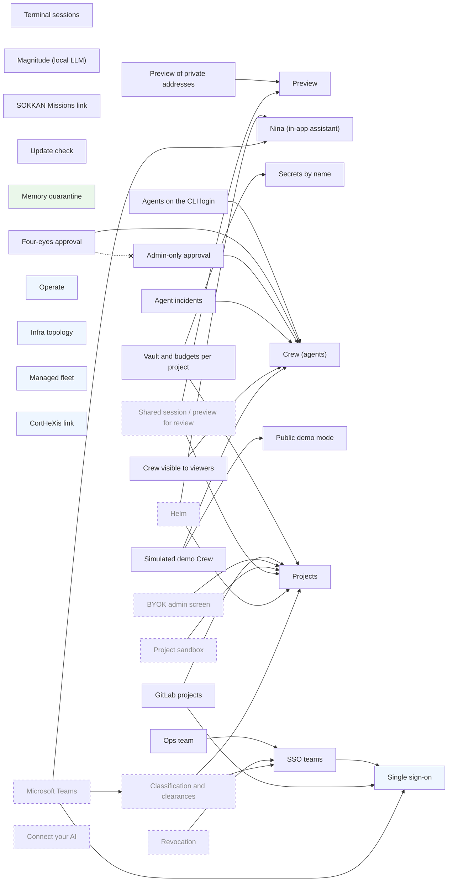

<!-- GENERATED by scripts/gen-features-doc.py from backend/features.py — do not edit. -->
# SOKKAN features

SOKKAN Enterprise is **the same open-source app**, not a fork. Every capability below is a feature of one registry (`backend/features.py`): it can be turned on or off on its own, its dependencies are declared, and the edition only changes **defaults**.

## How a feature is decided

1. `SOKKAN_EDITION` = `community` (default) or `enterprise` picks the column of defaults.
2. `SOKKAN_FEATURE_<ID>=1|0` turns a feature on or off. The variables used before the registry (marked *legacy*) are still read, after the canonical one: an existing installation changes nothing. An empty value counts as unset.
3. *integration* features are on when their service is configured; *invariant* features are security properties, always on; *planned* features are declared for the roadmap and stay off whatever the environment says.
4. A feature whose required feature is off, or whose conflicting feature is on, is **turned off** with its reason. The API always starts; a feature is never half on. If it had been asked for explicitly, the API logs `[features] <id> is OFF: <reason>` at startup and Profile → Features shows it in red.

State on a running instance: `GET /api/features` (`registry`) or Profile → Features (admins).

## Registry

| Feature | Status | Kind | Community | Enterprise | Requires | Conflicts | Switch |
|---|---|---|---|---|---|---|---|
| [`tmux`](#tmux) Terminal sessions | stable | toggle | on | on | — | — | `SOKKAN_FEATURE_TMUX` |
| [`preview`](#preview) Preview | stable | toggle | on | on | — | — | `SOKKAN_FEATURE_PREVIEW` |
| [`preview_private_targets`](#preview_private_targets) Preview of private addresses | stable | toggle | off | off | `preview` | — | `SOKKAN_FEATURE_PREVIEW_PRIVATE_TARGETS` `SOKKAN_PREVIEW_ALLOW_PRIVATE` (legacy: 1 = on) |
| [`magnitude`](#magnitude) Magnitude (local LLM) | stable | toggle | on | on | — | — | `SOKKAN_FEATURE_MAGNITUDE` |
| [`assistant`](#assistant) Nina (in-app assistant) | stable | toggle | off | off | — | — | `SOKKAN_FEATURE_ASSISTANT` |
| [`missions_link`](#missions_link) SOKKAN Missions link | stable | toggle | on | off | — | — | `SOKKAN_FEATURE_MISSIONS_LINK` |
| [`update_check`](#update_check) Update check | stable | toggle | on | on | — | — | `SOKKAN_FEATURE_UPDATE_CHECK` `SOKKAN_UPDATE_CHECK` (legacy) |
| [`named_secrets`](#named_secrets) Secrets by name | stable | toggle | on | on | — | — | `SOKKAN_FEATURE_NAMED_SECRETS` `SOKKAN_SESSION_SECRETS` (legacy: named = on, all = off, anything else = on) |
| [`memory_quarantine`](#memory_quarantine) Memory quarantine | stable | invariant | always | always | — | — | `SOKKAN_MEMORY_QUARANTINE_DIR` |
| [`agents`](#agents) Crew (agents) | stable | toggle | on | on | — | — | `SOKKAN_FEATURE_AGENTS` |
| [`agents_cli_login`](#agents_cli_login) Agents on the CLI login | stable | toggle | off | off | `agents` | — | `SOKKAN_FEATURE_AGENTS_CLI_LOGIN` `SOKKAN_AGENTS_USE_CLI_LOGIN` (legacy: 1 = on) |
| [`four_eyes`](#four_eyes) Four-eyes approval | stable | toggle | off | on | `agents` | `admin_approval` | `SOKKAN_FEATURE_FOUR_EYES` `SOKKAN_AGENTS_APPROVAL` (legacy: four_eyes = on, owner/admin = off) |
| [`admin_approval`](#admin_approval) Admin-only approval | stable | toggle | off | off | `agents` | `four_eyes` | `SOKKAN_FEATURE_ADMIN_APPROVAL` `SOKKAN_AGENTS_APPROVAL` (legacy: admin = on, owner/four_eyes = off) |
| [`agent_incidents`](#agent_incidents) Agent incidents | stable | toggle | auto | auto | `agents` | — | `SOKKAN_FEATURE_AGENT_INCIDENTS` `SOKKAN_AGENTS_INCIDENTS` (legacy) |
| [`crew_viewer_readonly`](#crew_viewer_readonly) Crew visible to viewers | stable | toggle | off | off | `agents` | — | `SOKKAN_FEATURE_CREW_VIEWER_READONLY` `SOKKAN_CREW_VIEWER_READONLY` (legacy) |
| [`demo_banner`](#demo_banner) Public demo mode | stable | toggle | off | off | — | — | `SOKKAN_FEATURE_DEMO_BANNER` `SOKKAN_DEMO_BANNER` (legacy: 0 = off, anything else = on) |
| [`demo_crew`](#demo_crew) Simulated demo Crew | stable | toggle | off | off | `agents`, `demo_banner` | — | `SOKKAN_FEATURE_DEMO_CREW` `SOKKAN_DEMO_CREW` (legacy) |
| [`sso`](#sso) Single sign-on | stable | integration | if configured | if configured | — | — | `SOKKAN_AUTH_MODE`, `SOKKAN_OIDC_ISSUER`, `SOKKAN_OIDC_CLIENT_ID` |
| [`multi_project`](#multi_project) Projects | beta | toggle | off | on | — | — | `SOKKAN_FEATURE_MULTI_PROJECT` |
| [`sso_teams`](#sso_teams) SSO teams | beta | toggle | on | on | `sso` | — | `SOKKAN_FEATURE_SSO_TEAMS` |
| [`operate`](#operate) Operate | stable | integration | if configured | if configured | — | — | `SOKKAN_PROM`, `SOKKAN_GRAFANA_URL` |
| [`ops_team`](#ops_team) Ops team | beta | toggle | on | on | `sso_teams` | — | `SOKKAN_FEATURE_OPS_TEAM` |
| [`infra`](#infra) Infra topology | stable | integration | if configured | if configured | — | — | `SOKKAN_PROM` |
| [`fleet`](#fleet) Managed fleet | stable | integration | if configured | if configured | — | — | `SOKKAN_FLEET_URL`, `SOKKAN_FLEET_TOKEN` |
| [`cortex`](#cortex) CortHeXis link | stable | integration | if configured | if configured | — | — | `SOKKAN_CORTEX_URL` |
| [`project_vault_budgets`](#project_vault_budgets) Vault and budgets per project | beta (3.2) | toggle | off | on | `multi_project`, `named_secrets` | — | `SOKKAN_FEATURE_PROJECT_VAULT_BUDGETS` |
| [`gitlab`](#gitlab) GitLab projects | beta | toggle | off | on | `multi_project`, `sso` | — | `SOKKAN_FEATURE_GITLAB` |
| [`revocation`](#revocation) Revocation | planned (3.2) | planned | off | off | `sso_teams` | — | `SOKKAN_FEATURE_REVOCATION` |
| [`byok_admin`](#byok_admin) BYOK admin screen | planned (3.2) | planned | off | off | `multi_project` | — | `SOKKAN_FEATURE_BYOK_ADMIN` |
| [`sandbox`](#sandbox) Project sandbox | planned (3.2) | planned | off | off | `multi_project` | — | `SOKKAN_FEATURE_SANDBOX` |
| [`shared_review`](#shared_review) Shared session / preview for review | planned (3.2) | planned | off | off | `preview`, `multi_project` | — | `SOKKAN_FEATURE_SHARED_REVIEW` |
| [`helm`](#helm) Helm | planned (3.3) | planned | off | off | `multi_project`, `assistant` | — | `SOKKAN_FEATURE_HELM` |
| [`classification`](#classification) Classification and clearances | planned (3.4) | planned | off | off | `multi_project`, `sso_teams` | — | `SOKKAN_FEATURE_CLASSIFICATION` |
| [`teams`](#teams) Microsoft Teams | planned (3.4) | planned | off | off | `assistant`, `classification`, `sso` | — | `SOKKAN_FEATURE_TEAMS` |
| [`connect_ai`](#connect_ai) Connect your AI | planned (3.3) | planned | off | off | — | — | `SOKKAN_FEATURE_CONNECT_AI` |

## Dependency graph

Solid arrow = *requires*; dotted = *conflicts with*. Dashed boxes are planned.

## Features

### tmux

**Terminal sessions** — stable, toggle.

Raw tmux/ttyd terminal sessions in the cockpit (spawn, live view, send keys).

- Defaults: community **on**, enterprise **on**
- Switch: `SOKKAN_FEATURE_TMUX`

### preview

**Preview** — stable, toggle.

Headless-browser previews of the apps built in a session (screenshots, envs).

- Defaults: community **on**, enterprise **on**
- Required by: `preview_private_targets`, `shared_review`
- Switch: `SOKKAN_FEATURE_PREVIEW`

### preview_private_targets

**Preview of private addresses** — stable, toggle.

Lets Preview open private / loopback targets (an app on the LAN). Off: SSRF guard.

- Defaults: community **off**, enterprise **off**
- Requires: `preview`
- Switch: `SOKKAN_FEATURE_PREVIEW_PRIVATE_TARGETS`, `SOKKAN_PREVIEW_ALLOW_PRIVATE` (legacy: 1 = on)

### magnitude

**Magnitude (local LLM)** — stable, toggle.

Hardware profile, benchmark and llama.cpp serving of a local model; memory bench.

- Defaults: community **on**, enterprise **on**
- Switch: `SOKKAN_FEATURE_MAGNITUDE`

### assistant

**Nina (in-app assistant)** — stable, toggle.

Nina, the cockpit's help agent. Needs an LLM (SOKKAN_ASSISTANT_LLM_*) and its knowledge base; paid in the guaranteed offer, the user's own model in open source.

- Defaults: community **off**, enterprise **off**
- Required by: `helm`, `teams`
- Switch: `SOKKAN_FEATURE_ASSISTANT`

### missions_link

**SOKKAN Missions link** — stable, toggle.

Header link to the public SOKKAN Missions marketplace, with a counter this instance fetches (6 h cache). Off in the enterprise edition: no call to a public service.

- Defaults: community **on**, enterprise **off**
- Switch: `SOKKAN_FEATURE_MISSIONS_LINK`

### update_check

**Update check** — stable, toggle.

One GET a day of dist/VERSION to tell the admin a new release exists.

- Defaults: community **on**, enterprise **on**
- Switch: `SOKKAN_FEATURE_UPDATE_CHECK`, `SOKKAN_UPDATE_CHECK` (legacy)

### named_secrets

**Secrets by name** — stable, toggle.

A human session only receives the vault secrets picked for it (or by its playbook). Off = `all`: every session receives the whole vault (3.1 behaviour, warned).

- Defaults: community **on**, enterprise **on**
- Required by: `project_vault_budgets`
- Switch: `SOKKAN_FEATURE_NAMED_SECRETS`, `SOKKAN_SESSION_SECRETS` (legacy: named = on, all = off, anything else = on)
- Forced on for SOKKAN Cloud managed instances (`SOKKAN_TIER` set).
- Doc: [docs/MULTIUSER.md](../../docs/MULTIUSER.md)

### memory_quarantine

**Memory quarantine** — stable, invariant.

A note written by an agent run waits in quarantine until a human approves it. A security invariant: it cannot be turned off.

- Defaults: community **always**, enterprise **always**
- Configuration: `SOKKAN_MEMORY_QUARANTINE_DIR`
- Doc: [docs/AGENTS.md](../../docs/AGENTS.md)

### agents

**Crew (agents)** — stable, toggle.

Scheduled and alert-triggered agents, their runs, deliverables and approvals.

- Defaults: community **on**, enterprise **on**
- Required by: `agents_cli_login`, `four_eyes`, `admin_approval`, `agent_incidents`, `crew_viewer_readonly`, `demo_crew`
- Switch: `SOKKAN_FEATURE_AGENTS`
- Doc: [docs/AGENTS.md](../../docs/AGENTS.md)

### agents_cli_login

**Agents on the CLI login** — stable, toggle.

Unattended agent runs may use the Claude CLI login found on the host (otherwise only credentials configured for this instance count).

- Defaults: community **off**, enterprise **off**
- Requires: `agents`
- Switch: `SOKKAN_FEATURE_AGENTS_CLI_LOGIN`, `SOKKAN_AGENTS_USE_CLI_LOGIN` (legacy: 1 = on)
- Doc: [docs/AGENTS.md](../../docs/AGENTS.md)

### four_eyes

**Four-eyes approval** — stable, toggle.

Activating an agent (or a change to an approved one) needs ANOTHER person than its proposer and its owner.

- Defaults: community **off**, enterprise **on**
- Requires: `agents`
- Conflicts with: `admin_approval`
- Switch: `SOKKAN_FEATURE_FOUR_EYES`, `SOKKAN_AGENTS_APPROVAL` (legacy: four_eyes = on, owner/admin = off)
- Doc: [docs/AGENTS.md](../../docs/AGENTS.md)

### admin_approval

**Admin-only approval** — stable, toggle.

Only an instance admin activates an agent (default: its owner or an admin).

- Defaults: community **off**, enterprise **off**
- Requires: `agents`
- Conflicts with: `four_eyes`
- Switch: `SOKKAN_FEATURE_ADMIN_APPROVAL`, `SOKKAN_AGENTS_APPROVAL` (legacy: admin = on, owner/four_eyes = off)
- Doc: [docs/AGENTS.md](../../docs/AGENTS.md)

### agent_incidents

**Agent incidents** — stable, toggle.

A run ending failed / timeout / over budget opens (or joins) its agent's incident in Operate. Default `auto`: on when Operate is configured.

- Defaults: community **auto**, enterprise **auto**
- Requires: `agents`
- Switch: `SOKKAN_FEATURE_AGENT_INCIDENTS`, `SOKKAN_AGENTS_INCIDENTS` (legacy)
- Doc: [docs/OPERATE.md](../../docs/OPERATE.md)

### crew_viewer_readonly

**Crew visible to viewers** — stable, toggle.

A viewer sees the whole Crew read-only (secret names, never values). Public demo.

- Defaults: community **off**, enterprise **off**
- Requires: `agents`
- Switch: `SOKKAN_FEATURE_CREW_VIEWER_READONLY`, `SOKKAN_CREW_VIEWER_READONLY` (legacy)
- Doc: [docs/AGENTS.md](../../docs/AGENTS.md)

### demo_banner

**Public demo mode** — stable, toggle.

Guided-tour banner of the public read-only demo instance.

- Defaults: community **off**, enterprise **off**
- Required by: `demo_crew`
- Switch: `SOKKAN_FEATURE_DEMO_BANNER`, `SOKKAN_DEMO_BANNER` (legacy: 0 = off, anything else = on)

### demo_crew

**Simulated demo Crew** — stable, toggle.

Simulated agent runs (no model, no inference) for the public demo only.

- Defaults: community **off**, enterprise **off**
- Requires: `agents`, `demo_banner`
- Switch: `SOKKAN_FEATURE_DEMO_CREW`, `SOKKAN_DEMO_CREW` (legacy)
- Doc: [docs/AGENTS.md](../../docs/AGENTS.md)

### sso

**Single sign-on** — stable, integration.

OIDC / LDAPS login (SOKKAN_AUTH_MODE). Configure it to turn it on.

- Defaults: community **if configured**, enterprise **if configured**
- Required by: `sso_teams`, `gitlab`, `teams`
- Configuration: `SOKKAN_AUTH_MODE`, `SOKKAN_OIDC_ISSUER`, `SOKKAN_OIDC_CLIENT_ID`
- Doc: [docs/MULTIUSER.md](../../docs/MULTIUSER.md)

### multi_project

**Projects** — beta, toggle.

Several isolated projects on one instance (sessions, board, agents, memory, workspace), roles per project. Off: no NEW project can be created; projects that exist keep their isolation (turning it off never opens data).

- Defaults: community **off**, enterprise **on**
- Required by: `project_vault_budgets`, `gitlab`, `byok_admin`, `sandbox`, `shared_review`, `helm`, `classification`
- Switch: `SOKKAN_FEATURE_MULTI_PROJECT`
- Doc: [docs/MULTIUSER.md](../../docs/MULTIUSER.md)

### sso_teams

**SSO teams** — beta, toggle.

Teams = the IdP's groups (claim `groups`), re-synchronised at each login; a team can be granted a project role.

- Defaults: community **on**, enterprise **on**
- Requires: `sso`
- Required by: `ops_team`, `revocation`, `classification`
- Switch: `SOKKAN_FEATURE_SSO_TEAMS`
- Doc: [docs/MULTIUSER.md](../../docs/MULTIUSER.md)

### operate

**Operate** — stable, integration.

Observability tab: alerts, incidents, dashboards. On when Prometheus or Grafana is configured.

- Defaults: community **if configured**, enterprise **if configured**
- Configuration: `SOKKAN_PROM`, `SOKKAN_GRAFANA_URL`
- Doc: [docs/OPERATE.md](../../docs/OPERATE.md)

### ops_team

**Ops team** — beta, toggle.

Operate / Infra open to an SSO group (the ops team) besides the instance admins.

- Defaults: community **on**, enterprise **on**
- Requires: `sso_teams`
- Switch: `SOKKAN_FEATURE_OPS_TEAM`
- Doc: [docs/MULTIUSER.md](../../docs/MULTIUSER.md)

### infra

**Infra topology** — stable, integration.

Infra tab: host topology from Prometheus.

- Defaults: community **if configured**, enterprise **if configured**
- Configuration: `SOKKAN_PROM`

### fleet

**Managed fleet** — stable, integration.

Infra tab: the managed client VMs of SOKKAN Cloud.

- Defaults: community **if configured**, enterprise **if configured**
- Configuration: `SOKKAN_FLEET_URL`, `SOKKAN_FLEET_TOKEN`

### cortex

**CortHeXis link** — stable, integration.

Link from the memory tab to a CortHeXis review UI.

- Defaults: community **if configured**, enterprise **if configured**
- Configuration: `SOKKAN_CORTEX_URL`

### project_vault_budgets

**Vault and budgets per project** — beta for 3.2, toggle.

Per-project vault, cost totals and budgets, agent names and CortHeXis review per project (lot 4). Off: a project other than `default` gets no vault secret, the CortHeXis review and the journal stay default / instance-admin only (fail-closed).

- Defaults: community **off**, enterprise **on**
- Requires: `multi_project`, `named_secrets`
- Switch: `SOKKAN_FEATURE_PROJECT_VAULT_BUDGETS`
- Doc: [docs/MULTIUSER.md](../../docs/MULTIUSER.md)

### gitlab

**GitLab projects** — beta, toggle.

Project access from GitLab roles read with the person's own account (OAuth PKCE; lowest level over the project's repositories, cached 10 min / 2 min), credential helper, push and merge requests in the person's name (lot 5).

- Defaults: community **off**, enterprise **on**
- Requires: `multi_project`, `sso`
- Switch: `SOKKAN_FEATURE_GITLAB`
- Doc: [docs/MULTIUSER.md](../../docs/MULTIUSER.md)

### revocation

**Revocation** — planned for 3.2, planned.

SCIM, « Revoke now », back-channel logout (lot 6).

- Defaults: community **off**, enterprise **off**
- Requires: `sso_teams`
- Switch: `SOKKAN_FEATURE_REVOCATION`
- Doc: [docs/MULTIUSER.md](../../docs/MULTIUSER.md)

### byok_admin

**BYOK admin screen** — planned for 3.2, planned.

Client admin screen for bring-your-own-key model credentials (lot 7).

- Defaults: community **off**, enterprise **off**
- Requires: `multi_project`
- Switch: `SOKKAN_FEATURE_BYOK_ADMIN`
- Doc: [docs/MULTIUSER.md](../../docs/MULTIUSER.md)

### sandbox

**Project sandbox** — planned for 3.2, planned.

Sensitive project sessions in their own uid / container: a session cannot read another project's files (lot 8).

- Defaults: community **off**, enterprise **off**
- Requires: `multi_project`
- Switch: `SOKKAN_FEATURE_SANDBOX`
- Doc: [docs/MULTIUSER.md](../../docs/MULTIUSER.md)

### shared_review

**Shared session / preview for review** — planned for 3.2, planned.

Share a session or a preview, read or read-write, so someone validates the work (Preview = the place of validation).

- Defaults: community **off**, enterprise **off**
- Requires: `preview`, `multi_project`
- Switch: `SOKKAN_FEATURE_SHARED_REVIEW`

### helm

**Helm** — planned for 3.3, planned.

Hierarchical boards manager → engineer kanban: context flows down, progress up; management view; Nina breaks work down; morning brief.

- Defaults: community **off**, enterprise **off**
- Requires: `multi_project`, `assistant`
- Switch: `SOKKAN_FEATURE_HELM`

### classification

**Classification and clearances** — planned for 3.4, planned.

Notes carry a classification; Nina acts on the user's behalf within their clearance; derived content inherits the highest level; audited recall.

- Defaults: community **off**, enterprise **off**
- Requires: `multi_project`, `sso_teams`
- Required by: `teams`
- Switch: `SOKKAN_FEATURE_CLASSIFICATION`

### teams

**Microsoft Teams** — planned for 3.4, planned.

@Nina in Teams, HITL approvals as Teams cards, decision capture, calendar/presence via Graph (tenant app, per-resource consent).

- Defaults: community **off**, enterprise **off**
- Requires: `assistant`, `classification`, `sso`
- Switch: `SOKKAN_FEATURE_TEAMS`

### connect_ai

**Connect your AI** — planned for 3.3, planned.

Personal mode (any engine, SOKKAN Router preselected) and governed mode (the admin sets the allowed engines).

- Defaults: community **off**, enterprise **off**
- Switch: `SOKKAN_FEATURE_CONNECT_AI`
