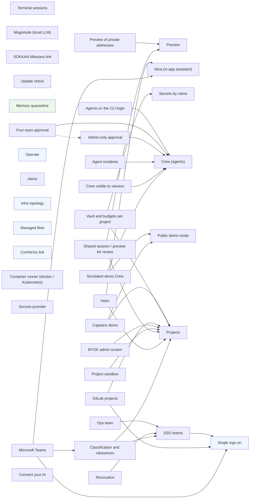

<!-- GENERATED by scripts/gen-features-doc.py from backend/features.py — do not edit. -->
# SOKKAN features

SOKKAN Enterprise is **the same open-source app**, not a fork. Every capability below is a feature of one registry (`backend/features.py`): it can be turned on or off on its own, its dependencies are declared, and the edition only changes **defaults**.

## How a feature is decided

1. `SOKKAN_EDITION` = `community` (default) or `enterprise` picks the column of defaults.
2. `SOKKAN_FEATURE_<ID>=1|0` turns a feature on or off. The variables used before the registry (marked *legacy*) are still read, after the canonical one: an existing installation changes nothing. An empty value counts as unset.
3. *integration* features are on when their service is configured; *invariant* features are security properties, always on; *planned* features are declared for the roadmap and stay off whatever the environment says.
4. A feature whose required feature is off, or whose conflicting feature is on, is **turned off** with its reason. The API always starts; a feature is never half on. If it had been asked for explicitly, the API logs `[features] <id> is OFF: <reason>` at startup and Setup › Organization › Features shows it in red.

State on a running instance: `GET /api/features` (`registry`) or Setup › Organization › Features (admins).

## Registry

| Feature | Status | Kind | Community | Enterprise | Requires | Conflicts | Switch |
|---|---|---|---|---|---|---|---|
| [`tmux`](#tmux) Terminal sessions | stable | toggle | on | on | — | — | `SOKKAN_FEATURE_TMUX` |
| [`preview`](#preview) Preview | stable | toggle | on | on | — | — | `SOKKAN_FEATURE_PREVIEW` |
| [`preview_private_targets`](#preview_private_targets) Preview of private addresses | stable | toggle | off | off | `preview` | — | `SOKKAN_FEATURE_PREVIEW_PRIVATE_TARGETS` `SOKKAN_PREVIEW_ALLOW_PRIVATE` (legacy: 1 = on) |
| [`magnitude`](#magnitude) Magnitude (local LLM) | stable | toggle | on | on | — | — | `SOKKAN_FEATURE_MAGNITUDE` |
| [`assistant`](#assistant) Nina (in-app assistant) | stable | toggle | off | off | — | — | `SOKKAN_FEATURE_ASSISTANT` |
| [`missions_link`](#missions_link) SOKKAN Missions link | stable | toggle | on | off | — | — | `SOKKAN_FEATURE_MISSIONS_LINK` |
| [`update_check`](#update_check) Update check | stable | toggle | on | on | — | — | `SOKKAN_FEATURE_UPDATE_CHECK` `SOKKAN_UPDATE_CHECK` (legacy) |
| [`named_secrets`](#named_secrets) Secrets by name | stable | toggle | on | on | — | — | `SOKKAN_FEATURE_NAMED_SECRETS` `SOKKAN_SESSION_SECRETS` (legacy: named = on, all = off, anything else = on) |
| [`memory_quarantine`](#memory_quarantine) Memory quarantine | stable | invariant | always | always | — | — | `SOKKAN_MEMORY_QUARANTINE_DIR` |
| [`agents`](#agents) Crew (agents) | stable | toggle | on | on | — | — | `SOKKAN_FEATURE_AGENTS` |
| [`agents_cli_login`](#agents_cli_login) Agents on the CLI login | stable | toggle | off | off | `agents` | — | `SOKKAN_FEATURE_AGENTS_CLI_LOGIN` `SOKKAN_AGENTS_USE_CLI_LOGIN` (legacy: 1 = on) |
| [`four_eyes`](#four_eyes) Four-eyes approval | stable | toggle | off | on | `agents` | `admin_approval` | `SOKKAN_FEATURE_FOUR_EYES` `SOKKAN_AGENTS_APPROVAL` (legacy: four_eyes = on, owner/admin = off) |
| [`admin_approval`](#admin_approval) Admin-only approval | stable | toggle | off | off | `agents` | `four_eyes` | `SOKKAN_FEATURE_ADMIN_APPROVAL` `SOKKAN_AGENTS_APPROVAL` (legacy: admin = on, owner/four_eyes = off) |
| [`agent_incidents`](#agent_incidents) Agent incidents | stable | toggle | auto | auto | `agents` | — | `SOKKAN_FEATURE_AGENT_INCIDENTS` `SOKKAN_AGENTS_INCIDENTS` (legacy) |
| [`crew_viewer_readonly`](#crew_viewer_readonly) Crew visible to viewers | stable | toggle | off | off | `agents` | — | `SOKKAN_FEATURE_CREW_VIEWER_READONLY` `SOKKAN_CREW_VIEWER_READONLY` (legacy) |
| [`demo_banner`](#demo_banner) Public demo mode | stable | toggle | off | off | — | — | `SOKKAN_FEATURE_DEMO_BANNER` `SOKKAN_DEMO_BANNER` (legacy: 0 = off, anything else = on) |
| [`demo_crew`](#demo_crew) Simulated demo Crew | stable | toggle | off | off | `agents`, `demo_banner` | — | `SOKKAN_FEATURE_DEMO_CREW` `SOKKAN_DEMO_CREW` (legacy) |
| [`demo_captains`](#demo_captains) Captains demo | beta | toggle | off | off | `demo_banner`, `multi_project` | — | `SOKKAN_FEATURE_DEMO_CAPTAINS` `SOKKAN_DEMO_CAPTAINS` (legacy) |
| [`sso`](#sso) Single sign-on | stable | integration | if configured | if configured | — | — | `SOKKAN_AUTH_MODE`, `SOKKAN_OIDC_ISSUER`, `SOKKAN_OIDC_CLIENT_ID` |
| [`multi_project`](#multi_project) Projects | beta | toggle | off | on | — | — | `SOKKAN_FEATURE_MULTI_PROJECT` |
| [`sso_teams`](#sso_teams) SSO teams | beta | toggle | on | on | `sso` | — | `SOKKAN_FEATURE_SSO_TEAMS` |
| [`operate`](#operate) Operate | stable | integration | if configured | if configured | — | — | `SOKKAN_PROM`, `SOKKAN_GRAFANA_URL` |
| [`alerting`](#alerting) Alerts | stable | toggle | on | on | — | — | `SOKKAN_FEATURE_ALERTING` |
| [`ops_team`](#ops_team) Ops team | beta | toggle | on | on | `sso_teams` | — | `SOKKAN_FEATURE_OPS_TEAM` |
| [`infra`](#infra) Infra topology | stable | integration | if configured | if configured | — | — | `SOKKAN_PROM`, `SOKKAN_HOSTS` |
| [`fleet`](#fleet) Managed fleet | stable | integration | if configured | if configured | — | — | `SOKKAN_FLEET_URL`, `SOKKAN_FLEET_TOKEN` |
| [`cortex`](#cortex) CortHeXis link | stable | integration | if configured | if configured | — | — | `SOKKAN_CORTEX_URL` |
| [`kubernetes_runner`](#kubernetes_runner) Container runner (docker / Kubernetes) | experimental | toggle | off | off | — | — | `SOKKAN_FEATURE_KUBERNETES_RUNNER` `SOKKAN_RUNNER` |
| [`project_vault_budgets`](#project_vault_budgets) Vault and budgets per project | beta (3.2) | toggle | off | on | `multi_project`, `named_secrets` | — | `SOKKAN_FEATURE_PROJECT_VAULT_BUDGETS` |
| [`gitlab`](#gitlab) GitLab projects | beta | toggle | off | on | `multi_project`, `sso` | — | `SOKKAN_FEATURE_GITLAB` |
| [`revocation`](#revocation) Revocation | beta | toggle | off | on | `sso_teams` | — | `SOKKAN_FEATURE_REVOCATION` |
| [`byok_admin`](#byok_admin) BYOK admin screen | beta | toggle | off | on | `multi_project` | — | `SOKKAN_FEATURE_BYOK_ADMIN` |
| [`secrets_provider`](#secrets_provider) Secrets provider | beta | toggle | off | on | — | — | `SOKKAN_FEATURE_SECRETS_PROVIDER` |
| [`sandbox`](#sandbox) Project sandbox | beta | toggle | off | on | `multi_project` | — | `SOKKAN_FEATURE_SANDBOX` |
| [`shared_review`](#shared_review) Shared session / preview for review | beta | toggle | off | on | `preview`, `multi_project` | — | `SOKKAN_FEATURE_SHARED_REVIEW` |
| [`helm`](#helm) Helm | stable | toggle | off | on | `multi_project`, `assistant` | — | `SOKKAN_FEATURE_HELM` |
| [`classification`](#classification) Classification and clearances | stable | toggle | off | on | `multi_project`, `sso_teams` | — | `SOKKAN_FEATURE_CLASSIFICATION` |
| [`teams`](#teams) Microsoft Teams | experimental | toggle | off | off | `assistant`, `classification`, `sso` | — | `SOKKAN_FEATURE_TEAMS` |
| [`connect_ai`](#connect_ai) Connect your AI | beta | toggle | off | on | — | — | `SOKKAN_FEATURE_CONNECT_AI` |

## Dependency graph

Solid arrow = *requires*; dotted = *conflicts with*. Dashed boxes are planned.

## Features

### tmux

**Terminal sessions** — stable, toggle.

Raw tmux/ttyd terminal sessions in the cockpit (spawn, live view, send keys).

- Defaults: community **on**, enterprise **on**
- Switch: `SOKKAN_FEATURE_TMUX`

### preview

**Preview** — stable, toggle.

Headless-browser previews of the apps built in a session (screenshots, envs).

- Defaults: community **on**, enterprise **on**
- Required by: `preview_private_targets`, `shared_review`
- Switch: `SOKKAN_FEATURE_PREVIEW`

### preview_private_targets

**Preview of private addresses** — stable, toggle.

Lets Preview open private / loopback targets (an app on the LAN). Off: SSRF guard.

- Defaults: community **off**, enterprise **off**
- Requires: `preview`
- Switch: `SOKKAN_FEATURE_PREVIEW_PRIVATE_TARGETS`, `SOKKAN_PREVIEW_ALLOW_PRIVATE` (legacy: 1 = on)

### magnitude

**Magnitude (local LLM)** — stable, toggle.

Hardware profile, benchmark and llama.cpp serving of a local model; memory bench.

- Defaults: community **on**, enterprise **on**
- Switch: `SOKKAN_FEATURE_MAGNITUDE`

### assistant

**Nina (in-app assistant)** — stable, toggle.

Nina, the cockpit's help agent. Needs an LLM (SOKKAN_ASSISTANT_LLM_*) and its knowledge base; paid in the guaranteed offer, the user's own model in open source.

- Defaults: community **off**, enterprise **off**
- Required by: `helm`, `teams`
- Switch: `SOKKAN_FEATURE_ASSISTANT`

### missions_link

**SOKKAN Missions link** — stable, toggle.

Header link to the public SOKKAN Missions marketplace, with a counter this instance fetches (6 h cache). Off in the enterprise edition: no call to a public service.

- Defaults: community **on**, enterprise **off**
- Switch: `SOKKAN_FEATURE_MISSIONS_LINK`

### update_check

**Update check** — stable, toggle.

One GET a day of dist/VERSION to tell the admin a new release exists.

- Defaults: community **on**, enterprise **on**
- Switch: `SOKKAN_FEATURE_UPDATE_CHECK`, `SOKKAN_UPDATE_CHECK` (legacy)

### named_secrets

**Secrets by name** — stable, toggle.

A human session only receives the vault secrets picked for it (or by its playbook). Off = `all`: every session receives the whole vault (3.1 behaviour, warned).

- Defaults: community **on**, enterprise **on**
- Required by: `project_vault_budgets`
- Switch: `SOKKAN_FEATURE_NAMED_SECRETS`, `SOKKAN_SESSION_SECRETS` (legacy: named = on, all = off, anything else = on)
- Forced on for SOKKAN Cloud managed instances (`SOKKAN_TIER` set).
- Doc: [docs/MULTIUSER.md](../../docs/MULTIUSER.md)

### memory_quarantine

**Memory quarantine** — stable, invariant.

A note written by an agent run waits in quarantine until a human approves it. A security invariant: it cannot be turned off.

- Defaults: community **always**, enterprise **always**
- Configuration: `SOKKAN_MEMORY_QUARANTINE_DIR`
- Doc: [docs/AGENTS.md](../../docs/AGENTS.md)

### agents

**Crew (agents)** — stable, toggle.

Scheduled and alert-triggered agents, their runs, deliverables and approvals.

- Defaults: community **on**, enterprise **on**
- Required by: `agents_cli_login`, `four_eyes`, `admin_approval`, `agent_incidents`, `crew_viewer_readonly`, `demo_crew`
- Switch: `SOKKAN_FEATURE_AGENTS`
- Doc: [docs/AGENTS.md](../../docs/AGENTS.md)

### agents_cli_login

**Agents on the CLI login** — stable, toggle.

Unattended agent runs may use the Claude CLI login found on the host (otherwise only credentials configured for this instance count).

- Defaults: community **off**, enterprise **off**
- Requires: `agents`
- Switch: `SOKKAN_FEATURE_AGENTS_CLI_LOGIN`, `SOKKAN_AGENTS_USE_CLI_LOGIN` (legacy: 1 = on)
- Doc: [docs/AGENTS.md](../../docs/AGENTS.md)

### four_eyes

**Four-eyes approval** — stable, toggle.

Activating an agent (or a change to an approved one) needs ANOTHER person than its proposer and its owner.

- Defaults: community **off**, enterprise **on**
- Requires: `agents`
- Conflicts with: `admin_approval`
- Switch: `SOKKAN_FEATURE_FOUR_EYES`, `SOKKAN_AGENTS_APPROVAL` (legacy: four_eyes = on, owner/admin = off)
- Doc: [docs/AGENTS.md](../../docs/AGENTS.md)

### admin_approval

**Admin-only approval** — stable, toggle.

Only an instance admin activates an agent (default: its owner or an admin).

- Defaults: community **off**, enterprise **off**
- Requires: `agents`
- Conflicts with: `four_eyes`
- Switch: `SOKKAN_FEATURE_ADMIN_APPROVAL`, `SOKKAN_AGENTS_APPROVAL` (legacy: admin = on, owner/four_eyes = off)
- Doc: [docs/AGENTS.md](../../docs/AGENTS.md)

### agent_incidents

**Agent incidents** — stable, toggle.

A run ending failed / timeout / over budget opens (or joins) its agent's incident in Operate. Default `auto`: on when Operate is configured.

- Defaults: community **auto**, enterprise **auto**
- Requires: `agents`
- Switch: `SOKKAN_FEATURE_AGENT_INCIDENTS`, `SOKKAN_AGENTS_INCIDENTS` (legacy)
- Doc: [docs/OPERATE.md](../../docs/OPERATE.md)

### crew_viewer_readonly

**Crew visible to viewers** — stable, toggle.

A viewer sees the whole Crew read-only (secret names, never values). Public demo.

- Defaults: community **off**, enterprise **off**
- Requires: `agents`
- Switch: `SOKKAN_FEATURE_CREW_VIEWER_READONLY`, `SOKKAN_CREW_VIEWER_READONLY` (legacy)
- Doc: [docs/AGENTS.md](../../docs/AGENTS.md)

### demo_banner

**Public demo mode** — stable, toggle.

Guided-tour banner of the public read-only demo instance.

- Defaults: community **off**, enterprise **off**
- Required by: `demo_crew`, `demo_captains`
- Switch: `SOKKAN_FEATURE_DEMO_BANNER`, `SOKKAN_DEMO_BANNER` (legacy: 0 = off, anything else = on)

### demo_crew

**Simulated demo Crew** — stable, toggle.

Simulated agent runs (no model, no inference) for the public demo only.

- Defaults: community **off**, enterprise **off**
- Requires: `agents`, `demo_banner`
- Switch: `SOKKAN_FEATURE_DEMO_CREW`, `SOKKAN_DEMO_CREW` (legacy)
- Doc: [docs/AGENTS.md](../../docs/AGENTS.md)

### demo_captains

**Captains demo** — beta, toggle.

Public demo only: the visitor (a viewer) sees Control › Helm and the board read-only, the project selector over 2-3 fictional projects, Setup › Engines and Organization read-only with fictional people (@example.com) and no key; every write under /api answers 403 « read-only demo » (Nina excepted). Seed: backend/demo_captains.py.

- Defaults: community **off**, enterprise **off**
- Requires: `demo_banner`, `multi_project`
- Switch: `SOKKAN_FEATURE_DEMO_CAPTAINS`, `SOKKAN_DEMO_CAPTAINS` (legacy)
- Doc: [docs/enterprise/UI-FEATURES.md](../../docs/enterprise/UI-FEATURES.md)

### sso

**Single sign-on** — stable, integration.

OIDC / LDAPS login (SOKKAN_AUTH_MODE). Configure it to turn it on.

- Defaults: community **if configured**, enterprise **if configured**
- Required by: `sso_teams`, `gitlab`, `teams`
- Configuration: `SOKKAN_AUTH_MODE`, `SOKKAN_OIDC_ISSUER`, `SOKKAN_OIDC_CLIENT_ID`
- Doc: [docs/MULTIUSER.md](../../docs/MULTIUSER.md)

### multi_project

**Projects** — beta, toggle.

Several isolated projects on one instance (sessions, board, agents, memory, workspace), roles per project. Off: no NEW project can be created; projects that exist keep their isolation (turning it off never opens data).

- Defaults: community **off**, enterprise **on**
- Required by: `demo_captains`, `project_vault_budgets`, `gitlab`, `byok_admin`, `sandbox`, `shared_review`, `helm`, `classification`
- Switch: `SOKKAN_FEATURE_MULTI_PROJECT`
- Doc: [docs/MULTIUSER.md](../../docs/MULTIUSER.md)

### sso_teams

**SSO teams** — beta, toggle.

Teams = the IdP's groups (claim `groups`), re-synchronised at each login; a team can be granted a project role.

- Defaults: community **on**, enterprise **on**
- Requires: `sso`
- Required by: `ops_team`, `revocation`, `classification`
- Switch: `SOKKAN_FEATURE_SSO_TEAMS`
- Doc: [docs/MULTIUSER.md](../../docs/MULTIUSER.md)

### operate

**Operate** — stable, integration.

Operate plane (Operate › Incidents): alerts, incidents, dashboards. On when Prometheus or Grafana is configured.

- Defaults: community **if configured**, enterprise **if configured**
- Configuration: `SOKKAN_PROM`, `SOKKAN_GRAFANA_URL`
- Doc: [docs/OPERATE.md](../../docs/OPERATE.md)

### alerting

**Alerts** — stable, toggle.

Operate › Alerts: alert rules evaluated by SOKKAN itself (threshold, any, frequency, spike, flatline, change, new term, cardinality, absence, anomaly) over Prometheus, Loki, Elasticsearch / OpenSearch and SOKKAN's own events; backtest drawn before saving, ready-made templates, silences and quiet hours, delivery to Telegram, Teams, Slack, e-mail, webhook or PagerDuty; actions (incident, diagnosis session, alert agent) under a person's go-ahead.

- Defaults: community **on**, enterprise **on**
- Switch: `SOKKAN_FEATURE_ALERTING`
- Doc: [docs/OPERATE.md](../../docs/OPERATE.md)

### ops_team

**Ops team** — beta, toggle.

Operate / Infra open to an SSO group (the ops team) besides the instance admins.

- Defaults: community **on**, enterprise **on**
- Requires: `sso_teams`
- Switch: `SOKKAN_FEATURE_OPS_TEAM`
- Doc: [docs/MULTIUSER.md](../../docs/MULTIUSER.md)

### infra

**Infra topology** — stable, integration.

Operate › Infra: host topology from Prometheus. Addresses are shown with a host name (SOKKAN_HOSTS, /etc/hosts, Tailscale, reverse DNS).

- Defaults: community **if configured**, enterprise **if configured**
- Configuration: `SOKKAN_PROM`, `SOKKAN_HOSTS`

### fleet

**Managed fleet** — stable, integration.

Operate › Infra: the managed client VMs of SOKKAN Cloud.

- Defaults: community **if configured**, enterprise **if configured**
- Configuration: `SOKKAN_FLEET_URL`, `SOKKAN_FLEET_TOKEN`

### cortex

**CortHeXis link** — stable, integration.

Link from Control › CortHeXis to a CortHeXis review UI.

- Defaults: community **if configured**, enterprise **if configured**
- Configuration: `SOKKAN_CORTEX_URL`

### kubernetes_runner

**Container runner (docker / Kubernetes)** — experimental, toggle.

Each session and agent run gets its own container (SOKKAN_RUNNER=docker, compose host) or Pod (SOKKAN_RUNNER=kubernetes, Helm chart): non-root, CPU/memory limits, only its project's workspace mounted, no network but the api's MCP relay and the egress gateway. Off (SOKKAN_RUNNER=local): the CLI runs inside the api, as before.

- Defaults: community **off**, enterprise **off**
- Switch: `SOKKAN_FEATURE_KUBERNETES_RUNNER`, `SOKKAN_RUNNER`
- Doc: [docs/enterprise/KUBERNETES.md](../../docs/enterprise/KUBERNETES.md)

### project_vault_budgets

**Vault and budgets per project** — beta for 3.2, toggle.

Per-project vault, cost totals and budgets, agent names and CortHeXis review per project (lot 4). Off: a project other than `default` gets no vault secret, the CortHeXis review and the journal stay default / instance-admin only (fail-closed).

- Defaults: community **off**, enterprise **on**
- Requires: `multi_project`, `named_secrets`
- Switch: `SOKKAN_FEATURE_PROJECT_VAULT_BUDGETS`
- Doc: [docs/MULTIUSER.md](../../docs/MULTIUSER.md)

### gitlab

**GitLab projects** — beta, toggle.

Project access from GitLab roles read with the person's own account (OAuth PKCE; lowest level over the project's repositories, cached 10 min / 2 min), credential helper, push and merge requests in the person's name (lot 5).

- Defaults: community **off**, enterprise **on**
- Requires: `multi_project`, `sso`
- Switch: `SOKKAN_FEATURE_GITLAB`
- Doc: [docs/MULTIUSER.md](../../docs/MULTIUSER.md)

### revocation

**Revocation** — beta, toggle.

SCIM 2.0 provisioning endpoint (Users, Groups) and the admin « Revoke now »: cockpit sessions invalidated, live sessions stopped, owned agents paused, forge tokens erased; teams recomputed at each SSO login; an agent never outlives its owner's access (lot 6). OIDC back-channel logout (3.4): a sign-out at the IdP ends the cockpit sessions born from that IdP session; front-channel for Entra ID with SOKKAN_OIDC_FRONTCHANNEL_LOGOUT=1.

- Defaults: community **off**, enterprise **on**
- Requires: `sso_teams`
- Switch: `SOKKAN_FEATURE_REVOCATION`
- Doc: [docs/MULTIUSER.md](../../docs/MULTIUSER.md)

### byok_admin

**BYOK admin screen** — beta, toggle.

Setup › Engines: the instance admin sets, replaces or deletes the model provider keys (Anthropic, …), stored encrypted with the vault key, never shown again (last 4 characters, date, who); optional validity test; exposed to the sessions; pushed to the SOKKAN gateway's BYOK endpoint when one is configured (lot 7). Per-project keys: the field exists, planned.

- Defaults: community **off**, enterprise **on**
- Requires: `multi_project`
- Switch: `SOKKAN_FEATURE_BYOK_ADMIN`
- Doc: [docs/enterprise/UI-FEATURES.md](../../docs/enterprise/UI-FEATURES.md)

### secrets_provider

**Secrets provider** — beta, toggle.

Where secrets and encryption keys live (3.3): `file` (vault.json + key files, the 3.2 behaviour), `openbao` (OpenBao / HashiCorp Vault: KV v2 for project secrets, transit wraps the data keys — no clear key on disk; AppRole or Kubernetes auth) or `kubernetes` (Secrets of the namespace). Picked ONLY by SOKKAN_SECRETS_PROVIDER (explicit); unset: file, even when SOKKAN_OPENBAO_ADDR is configured (startup warning; an enterprise instance on file shows a warning in Setup › Secrets). Off: always file.

- Defaults: community **off**, enterprise **on**
- Switch: `SOKKAN_FEATURE_SECRETS_PROVIDER`
- Doc: [docs/enterprise/SECRETS.md](../../docs/enterprise/SECRETS.md)

### sandbox

**Project sandbox** — beta, toggle.

A session or an agent run of a project (not `default`) reaches only its project's space: file tools checked by a hook (paths resolved, symlinks followed), Bash inside bubblewrap when the host has it, refused otherwise (lot 8). Hooks-only (no bubblewrap, no Kubernetes runner): Bash is disabled outside `default`, never asked to a human; the session and the agent/session UI say so (« Bash is disabled in this project: sandbox is hooks-only… ») with the fix: install bubblewrap, enable the Kubernetes runner, or work in `default` (OPERATIONS.md § 4.1).

- Defaults: community **off**, enterprise **on**
- Requires: `multi_project`
- Switch: `SOKKAN_FEATURE_SANDBOX`
- Doc: [docs/MULTIUSER.md](../../docs/MULTIUSER.md)

### shared_review

**Shared session / preview for review** — beta, toggle.

Share a session or a preview with a person or a team of its project, read or read-write, optionally for a limited time; the recipient sees it in their rail (« shared by … »); read-write can receive the session's delegated HITL approval. Never wider than the project role (a viewer never gets write); logged; revocable.

- Defaults: community **off**, enterprise **on**
- Requires: `preview`, `multi_project`
- Switch: `SOKKAN_FEATURE_SHARED_REVIEW`
- Doc: [docs/enterprise/UI-FEATURES.md](../../docs/enterprise/UI-FEATURES.md)

### helm

**Helm** — stable, toggle.

Hierarchical cards (manager's project card → engineer's cards → sub-tasks): the parent's intent, constraints and decisions flow down into the sessions, progress flows up (computed, never declared); the Helm view for project managers; Nina interviews and breaks a project down into a project the manager steers, Helm suggests reframes (a manager approves or ignores); the morning brief on demand (« My brief ») and as an agent template (ICS calendar). Shows each manager only the cards they are cleared for (classification). Stable since 3.4 (criteria: docs/HELM.md).

- Defaults: community **off**, enterprise **on**
- Requires: `multi_project`, `assistant`
- Switch: `SOKKAN_FEATURE_HELM`
- Doc: [docs/HELM.md](../../docs/HELM.md)

### classification

**Classification and clearances** — stable, toggle.

Notes, decisions, cards and agent deliverables carry a level (public < team < project < confidential < restricted); each person a clearance per project from their SSO groups and project role. Recall, memory_search / memory_get, the Control › CortHeXis, the board, Nina and Teams return only what the person is cleared for; derived content inherits the highest level of its sources; every note handed out is logged (audited recall, readable and exported by the project's admins). Helm too shows each manager only what they are cleared for. Off: nothing above `project` is reachable. Stable since 3.4.

- Defaults: community **off**, enterprise **on**
- Requires: `multi_project`, `sso_teams`
- Required by: `teams`
- Switch: `SOKKAN_FEATURE_CLASSIFICATION`
- Doc: [docs/enterprise/SECURITY.md](../../docs/enterprise/SECURITY.md)

### teams

**Microsoft Teams** — experimental, toggle.

@Nina in Teams channels and chats (project status, cards, proposed agents → approval), HITL approvals as signed single-use Adaptive Cards — also pushed to the project's channel the moment they start waiting —, decision capture into CortHeXis, channel ↔ project mapping, calendar via Graph for the brief. One tenant per instance (enforced on every activity), admin consent, Nina answers as the identified user only. 3.4.1: from the cockpit, « find me someone available to help with X » — Nina proposes who (presence + calendar) and the message with a real @mention in the project's channel; it is posted on the person's click only.

- Defaults: community **off**, enterprise **off**
- Requires: `assistant`, `classification`, `sso`
- Switch: `SOKKAN_FEATURE_TEAMS`
- Doc: [docs/enterprise/TEAMS.md](../../docs/enterprise/TEAMS.md)

### connect_ai

**Connect your AI** — beta, toggle.

Setup › Engines: one screen to connect the engines (Claude login or key, OpenAI/Codex, Gemini, OpenRouter, SOKKAN Router, Ollama/local, Magnitude). Personal mode (community: any engine, SOKKAN Router preselected) or governed mode (enterprise: the admin sets the allowed engines, zones and tiers; choice per project). A connected engine can drive a Crew card.

- Defaults: community **off**, enterprise **on**
- Switch: `SOKKAN_FEATURE_CONNECT_AI`
- Doc: [docs/enterprise/UI-FEATURES.md](../../docs/enterprise/UI-FEATURES.md)
